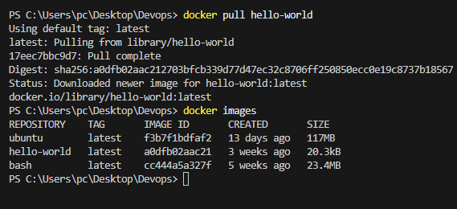

1. docker pull <IMAGE_NAME>  -> Pulls the latest images from the docker hub repository

2. docker images  -> Shows the list of images. 

3. docker run <hello-world/Image_name>  -> Builds ythe container from the images. 

4. docker run -it <Image_Name>  -> "-it" provides an interactive terminal for the container. 

5. docker ps -> Shows the running containers. 

6. docker ps -a -> Shows the stopped containers

7. docker start <Container_name/Container_id>

8. docker stop <Container_name/Container_id>

9. docker run -d <Image_name/Image_id>  -> "-d" meaning the containers runs on the background  "Detach mode"

10. docker run -itd <Container_name/Container_id>  -> "itd" -> means the container will start an interactive shell and runs on the background

11. docker rmi <Image_name>  -> Removes the image
    11.1 You need to delete the container first to delete the image

12. docker rm <Container_name/Container_id>

13. docker pull mysql:<tag> -> If you want to pull an image of other versions

14. some containers needs you to set the env variables. 

Example if you are running a mysql instance

docker run -itd -e MYSQL_ROOT_PASSWORD=root mysql:<tag>

- "-e" option is used to save the enviournment variable

you can check that by doing env | grep MYSQL  -> It will show you the env variable 