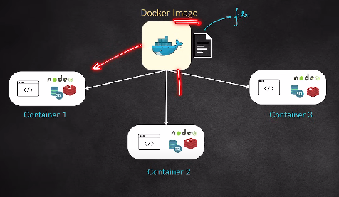

1. Docker is a platform which help us to make containers. 

2. Containers are something which we have packed the application along with the dependanncies. 

3. Containers are portable, example - you can provide the docker file to someone else and they can get the container installed in their machine

4. Containers are light weight - they operate on the same OS that the system is using and share the resources

5. Docker image is a blue print which we can use to create multiple containers, first an image needs to be created. 

    

6. Docker image is an snapshot of the instance

7. Docker containers are actually running instances which are buit using docker images. 

8. Example: docker run -it bash/ubuntu -> What this command does is. It pulls the image from the docker hub and creates a container based on the image