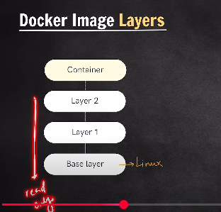

1. Docker Image Layers

   

2. These layers are read-only layers, which are immutable in nature. Only Container layer is mutable and can be changed.

3. The base layer is basically of a light weight Linux distribution called as alpine

4. What docker does is if two instances for example of MYSQL is present, some of the layers might exist already. so docker uses those layers to create the latest container. 

