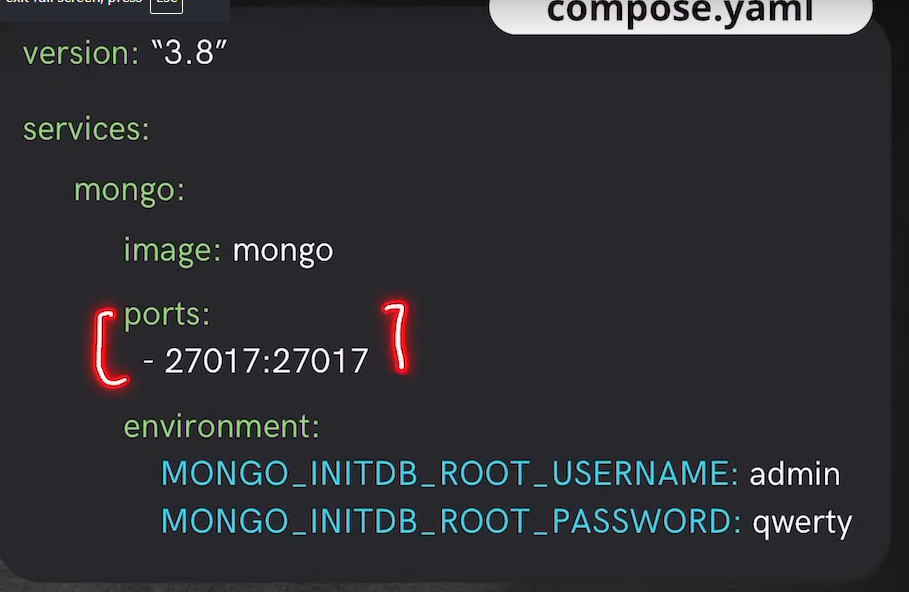

1. Docker compose is a tool fotr defining multi container application. 

2. Basically a YAML file is used create multiple containers. 

3. 

4. Thought ! -> What is the difference between a docker compose YAML file and a dockerfile ?

-  Basically docker file is used to create images, this images will be further used to build the containers. 

- Docker compose creates the standard images and creates the containers. 

5. Question ? -> If we want to use the image that is created by us to build the containers, can we use that docker file inside the docker compose YAML file ?

6. Docker Compose: 
         Two Commands 
        - docker compose -f <file_name> up -d -> To run the containers with the detached mode.
        - docker compose -f <file_name> down -> To delete the containers

7. Without docker volumes there is no data persistance. 