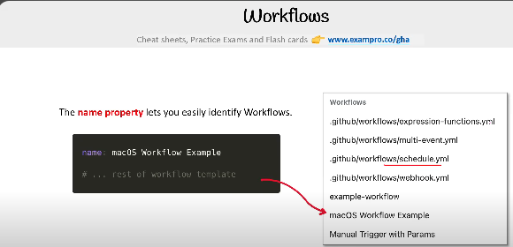
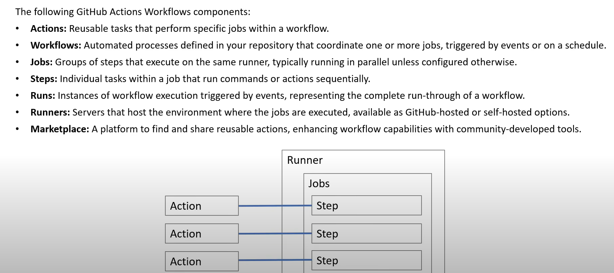

1. A workflow is a configurable automated process that will run one or more jobs 

2. Workflows are defined by YAML files. 

3. Workflows are defined under .github/workflows

4. Workflow triggers are events that cause a workflow to run:
   4.1 Events that occurs in your workflow repository
   4.2 Events that occurs outside of github and trigger a "repository dispatch" event on github
   4.3 Scheduled times
   4.4 Manual  -> Manually triggering a workflow

5. The "name_property" lets you identify the workflows. 

        

6. Github actions workflow components:

    6.1 Actions
    6.2 Workflows
    6.3 Jobs
    6.4 Steps
    6.5 Runs
    6.6 Runners 
    6.7 Marketplace

    